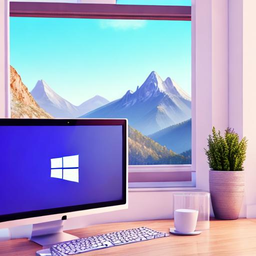
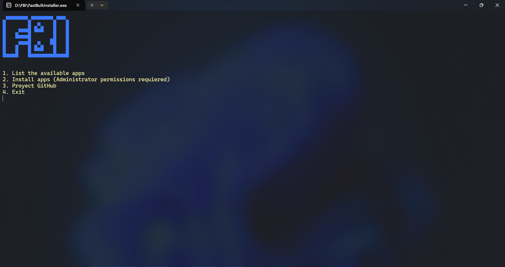
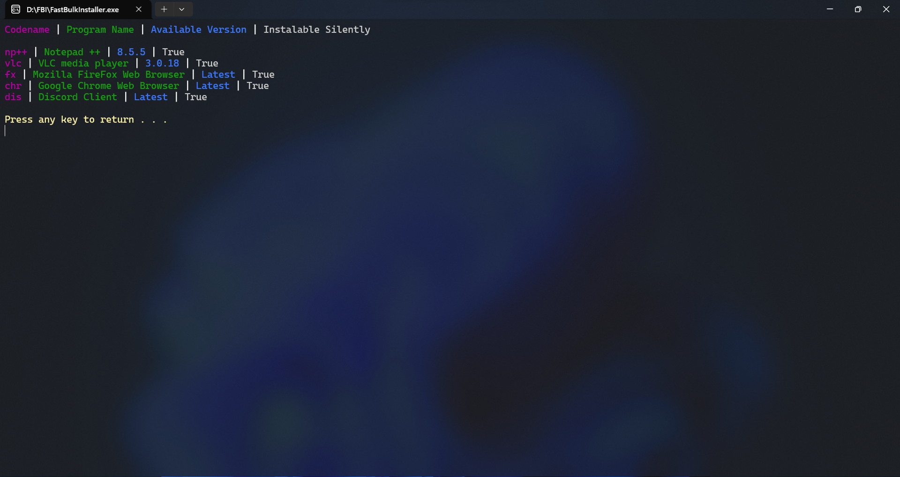

# FastBulkInstaller

An easy way to bulk install your programs

## Tutorial

https://youtu.be/O5OVfGqE_po

## Features

- Easily and Silently bulk install programs
- UltraSilent bulk install mode

## Screenshots

## Installation

Extract the zip and run directly!
No instalation needed.

## Usage

1. Launch FBI to create "config.yaml" file
2. Select option 1 to check available programs on the database
3. Copy the codenames and paste them on "config.yaml"
4. Select how you want to install
    1. (Via the FBI UI) Select option 2 on the main menu to install
    2. (UltraSilent) (FastBulkInstaller.exe /S) via cmd

## Contributing

Contributions expanding the database are always welcomed! To contribute open a new issue with the database tag.
[FBI database](https://pastebin.com/XkgNYRTL)

## Reposting
Please <u>DO NOT.</u> repost the .exe file directly, redirecting to the proyect's GitHub page is allowed.
